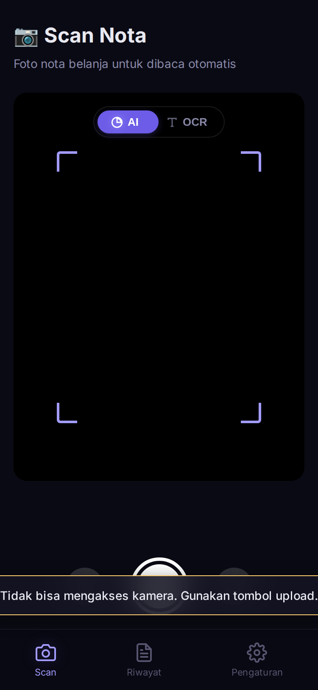
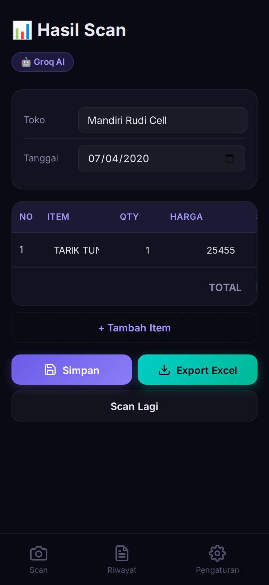
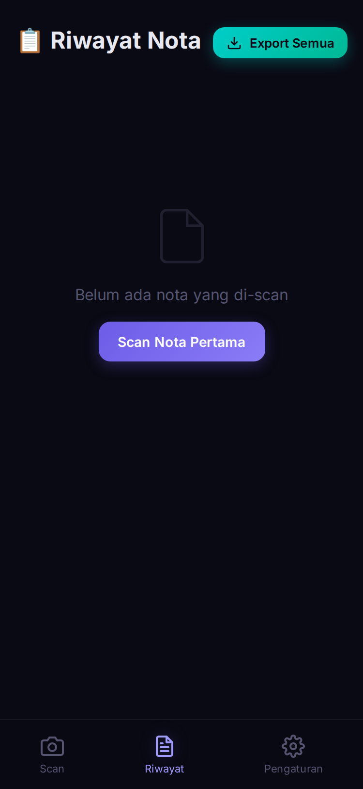
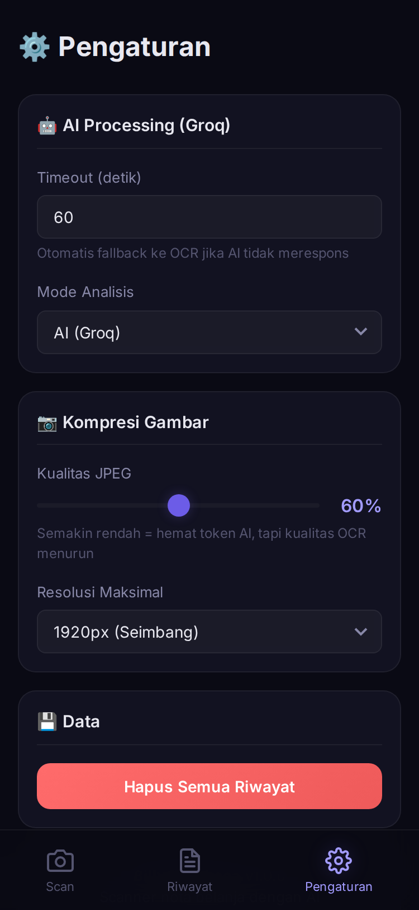

# 🧾 AI Bill Scanner - ExpressJS Intelligent Receipt Analysis with AI and OCR

**AI Bill Scanner** is a modern, high-performance web application designed to scan, extract, and manage shopping receipt data automatically. Powered by advanced **Groq AI (Vision)** and robust **OCR (Tesseract.js)**, this tool simplifies expense tracking by converting receipt images into structured, actionable data. It features a custom **liquid-glass design system** optimized for mobile workflows, with real-time AI parsing and multi-scan capabilities for long receipts.


---

Experience a seamless workflow from capturing receipts to managing data with **AI Bill Scanner**.

| | |
|:---:|:---:|
| <br>**Camera View**<br>*Manual AI/OCR Toggle & Controls* | <br>**Scan Result**<br>*Structured Data Extraction* |
| <br>**History View**<br>*Manage Saved Receipts* | <br>**Settings**<br>*AI & Image Quality Config* |

---

### 🤖 Intelligent Extraction
*   **Dual Engine Support**: Choose between high-accuracy **AI Analysis (Groq Vision)** or fast **Local OCR (Tesseract.js)**.
*   **Bank Receipt Optimization**: Specially tuned to recognize bank transactions (Mandiri, BCA, etc.), including transfer types and fees.
*   **Smart Multi-Scan**: Append multiple receipt photos into a single table result to handle long receipts.

### 📊 Data Management
*   **Export to Excel**: One-click export for individual receipts or the entire history to `.xls` / `.csv` format.
*   **Persistent History**: All scans are saved locally using **IndexedDB**, ensuring data persists across sessions.
*   **Dynamic Editing**: Manually adjust extracted items, quantities, and prices before saving to history.

### 📱 Modern Experience
*   **Mobile-First Design**: Premium dark-mode UI with silk animations and glassmorphic elements (Liquid Glass aesthetic).
*   **PWA Ready**: Fully installable on Android and iOS with service worker caching for offline access.
*   **Responsive Camera**: Supports multiple orientations and instant camera flipping for versatile scanning.

---

### 🛠️ Technical Stack
*   **Framework**: Vite (Vanilla JavaScript)
*   **AI Engine**: Groq AI SDK (`llama-3.2-11b-vision-preview`)
*   **OCR Library**: Tesseract.js (Local Client-Side Processing)
*   **Styling**: Pure CSS3 (Custom Design System with Glassmorphism)
*   **Data Export**: SheetJS (XLSX implementation)
*   **Infrastructure**: IndexedDB & LocalStorage for zero-backend persistence.

---

### 📂 Project Structure

```bash
/
├── public/            # Static assets (SW, Manifest, Icons)
├── src/               # Source code
│   ├── groq.js        # Groq Vision implementation & Prompting
│   ├── parser.js      # OCR Text parsing & Bank patterns
│   ├── main.js        # App State & View Controllers
│   ├── table.js       # Dynamic result table management
│   ├── export.js      # Excel/CSV generation logic
│   └── style.css      # Core Design System
├── index.html         # Main Application UI
├── package.json       # Project dependencies
└── vite.config.js     # Build configuration
```

---

### 📦 Getting Started

#### Prerequisites
*   **Node.js 18+**
*   **Groq API Key**: Obtain one from the [Groq Console](https://console.groq.com/keys).

#### Installation & Development
```bash
# Clone the repository
git clone https://github.com/widifirmaan/billymembaca-Bill-Scanner.git

# Install Dependencies
npm install

# Setup Environment Variables
# Create a .env file in the root directory:
echo "VITE_GROQ_API_KEY=your_groq_api_key_here" > .env

# Run Development Server
npm run dev
```
*Open the provided local URL (usually [http://localhost:5173](http://localhost:5173)) to start scanning.*

---

## 👥 Authors

Developed by **Widi Firmaan**.

---

## 📜 License
This project is developed for productivity and expense management. Any distribution or commercial use requires prior authorization.

---

**AI Bill Scanner - Precision in Every Pixel** 🚀
